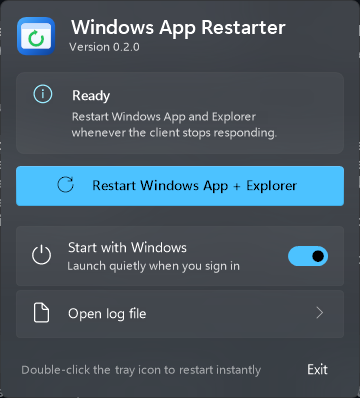

# Windows App Restarter

<p align="center">
  
</p>

A tiny Windows tray utility that restarts the Windows App / Windows 365 client processes and restarts Explorer.

It replaces this common manual script:

```powershell
Get-Process -Name Windows365, msrdcw, msrdc | Stop-Process -Force
Get-Process -Name explorer | Stop-Process -Force
Start-Process explorer.exe
```

<p align="center">
  
</p>

## What it does

- Adds a tray icon named **Windows App Restarter**.
- Click the icon to open a Windows 11 style flyout with the restart button, live progress, the last result, and settings.
- Double-click the icon to restart immediately, or right-click for a compact menu.
- Launching the app opens the flyout; launching it again activates the existing tray instance instead of starting a duplicate copy.
- The auto-start entry uses `--background` so the flyout does not pop open every time you sign in.
- Stops `Windows365`, `msrdcw`, and `msrdc` if they are running.
- Restarts `explorer.exe` and recreates the tray icon afterward.
- Shows a Windows notification with the result when the flyout is closed.
- Can start automatically when you sign in.
- Writes logs to `%LOCALAPPDATA%\WindowsAppRestarter\WindowsAppRestarter.log`.

## Design

The flyout follows the Windows 11 Fluent design system and is drawn natively with no UI framework dependencies:

- Acrylic backdrop, rounded corners, and a DWM border, with a solid fallback when transparency effects are off.
- Light and dark theme, your accent color, and high contrast are picked up from Windows automatically.
- Segoe UI Variable type ramp and Segoe Fluent Icons glyphs.
- Slides in from the taskbar edge, closes when you click away or press <kbd>Esc</kbd>, and supports keyboard navigation.
- Per-monitor DPI aware.

## Install

Download the latest release from GitHub Releases.

Recommended:

1. Run `WindowsAppRestarterSetup.exe`.
2. Keep **Start Windows App Restarter when I sign in** checked if you want it to persist across reboots.
3. Use the tray icon whenever the Windows App needs a restart.

Portable:

1. Download `WindowsAppRestarter-win-x64-portable.zip`.
2. Extract it somewhere stable, such as `%LOCALAPPDATA%\Programs\WindowsAppRestarter`.
3. Run `WindowsAppRestarter.exe`.
4. Turn on **Start with Windows** in the flyout.

## Build locally

Requirements:

- Windows
- .NET 10 SDK

```powershell
.\scripts\publish-local.ps1
.\scripts\build-installer.ps1
```

To regenerate the icon and logo assets after editing `scripts\generate-assets.ps1`:

```powershell
.\scripts\generate-assets.ps1
```

The generated executable is written to:

```text
artifacts\publish\win-x64\WindowsAppRestarter.exe
```

The generated installer is written to:

```text
installer\Output\WindowsAppRestarterSetup.exe
```

## Notes

This app is unsigned. Windows SmartScreen may warn the first time you run a downloaded build.
